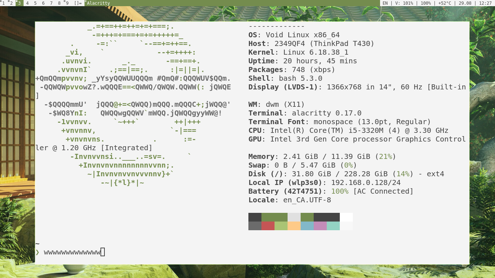
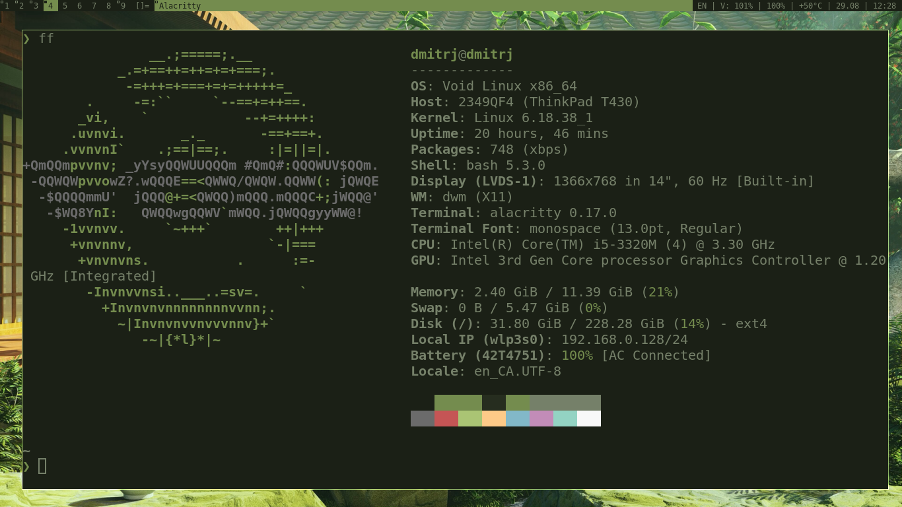

# dwm-gruvbox
simply .h dwm configuration for your family.

This is so simple DWM dots that you will hardly find something easier lol

What it will look like:



and this like:


## HOW TO INSTALL????

1. **Clone the repository:**
```bash
    git clone https://github.com/Dymon1403/dwm-gruvbox.git
    cd dwm-gruvbox.git
    chmod +x install.sh

```

 2. **Run the script:**
```bash

   ./install.sh

```

3. **can be used:**
```bash

```

